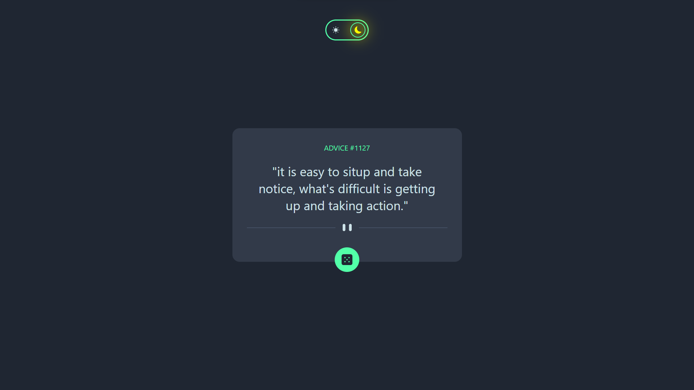

# [Frontend Mentor](https://www.frontendmentor.io) - Advice generator app

## Welcome! 👋

## Table of contents

- [Overview](#overview)
  - [The challenge](#the-challenge)
  - [Screenshot](#screenshot)
  - [Links](#links)
- [My process](#my-process)
  - [Built with](#built-with)
- [Author](#author)

## Overview

### The challenge

The challenge is to build out this advice generator app using the [Advice Slip API](https://api.adviceslip.com).

Users should be able to:

- View the optimal layout for the app depending on their device's screen size
- See hover states for all interactive elements on the page
- Generate a new piece of advice by clicking the dice icon

### Screenshot

### Links

- Solution URL: [Add solution URL here](https://your-solution-url.com)
- Live Site URL: [Add live site URL here](https://your-live-site-url.com)

## My process

### Built with

- Semantic HTML5 markup
- CSS custom properties
- Flexbox
- CSS Grid
- Mobile-first workflow

## Author

<!-- - Website - [Add your name here](https://www.your-site.com) -->

- Frontend Mentor - [@moha_tangx](https://www.frontendmentor.io/profile/moha-tangx)
- Twitter - [@moha_tangx](https://www.twitter.com/moha_tangx)
- Instagram/Threads - [@moha_tangx](https://www.instagram.com/moha_tangx)
